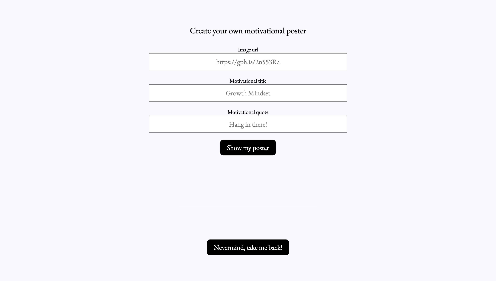

# Hang In There

Life can be challenging at times and we all know how difficult it can be for many to gain the motivation you need to prevail. Created by Alex Osgood and Lee Young and using JavaScript for functionality, we created `You Got This!`, a randomized set of motivational posters that can put a smile on any human and inspire them to keep going!

Within this repo, you can shuffle through posters, save or remove any poster within your saved posters page and even create the poster that really inspires you!

## Set Up

1. Clone down this repository to your local machine
3. In your terminal, cd into the repository
4. From there, type `open index.html`
5. Enjoy!

Project spec & rubric can be found [here](https://frontend.turing.io/projects/module-1/hang-in-there.html)

--------------

